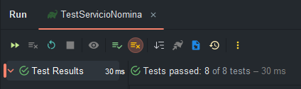

# Práctica en el Aula 1

## Instrucciones para correr los tests en IntelliJ IDEA

1. Clonar el proyecto desde el IDE o con `git clone https://github.com/JosueGG04/ICC-443.git`
2. En caso de que el IDE no lo haga automáticamente: configurar el proyecto
3. Sincronizar dependencias del proyecto
4. Para ejecutar los tests hay 2 opciones:
    - Ir a `src/test/java/services/` y abrir el archivo `TestServicioNomina.java`. Luego presionar el ícono de ejecutar
      tests al lado de la definición de la clase.
    - Hacer clic en el ícono de gradle, ir la tarea `verification/test` y correrla.

## Resultados de los tests

Todos los tests pasan, como se muestra en la imagen a continuación:

## Preguntas de reflexión

### ¿Cómo influyó el enfoque TDD en tu proceso de desarrollo?

El enfoque TDD influyó en el proceso de desarrollo al obligándonos a pensar primero en los
requisitos y comportamientos esperados del código antes de escribir la implementación. Esto ayudó a definir
claramente las expectativas y a asegurarse de que el código cumpliera con los criterios de aceptación desde el
principio.

### ¿Qué beneficios notaste al escribir primero los tests?

Escribir primero los test permite identificar la manera en que el código debe comportarse antes de escribirlo y facilita
tomar en cuenta los comportamientos necesarios y los posibles errores que pueden surgir.

### ¿Qué dificultades encontraste en la aplicación del enfoque?

Escribir los tests antes es ciertamente es un desafio pues requiere pensar al revés, es decir, pensar en cómo puede
fallar el código antes de escribirlo.

### ¿Consideras que el código resultante es más confiable y fácil de mantener?

El código resultante es más confiable y fácil de mantener porque está basado y respaldado por pruebas que garantizan su
correcto funcionamiento.

### ¿Qué aprendizajes sobre aseguramiento de la calidad puedes aplicar en tus futuros proyectos?

La creación de pruebas unitarias y la práctica de TDD son aprendizajes que se intentaran aplicar en futuros proyectos
para mejorar la calidad de estos, ya que estos mejoran en gran medida la confiabilidad del código y facilitan su
mantenimiento.

# Estudiantes

- Josué de Jesús García 1014-5567

- Leandro Jiménez 1014-5345